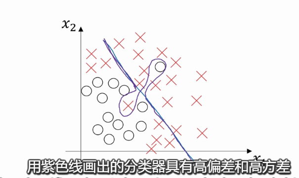

# 偏差 / 方差 —— bias/variance

偏差 / 方差 这两个概念易学难用，即使你自认为已经理解了偏差和方差的基本概念，却总有一些意想不到的新东西出现。  
关于深度学习的误差error问题，另一个趋势是对偏差/方差权衡(trade-off)的研究甚浅，即在深度学习的误差error中我们总是分别讨论偏差和方差，很少权衡二者。 

1. 偏差 / 方差

2. 研究偏差/方差的几个指标
理解偏差/方差的两个关键变量是：train set error 和 dev set error。

