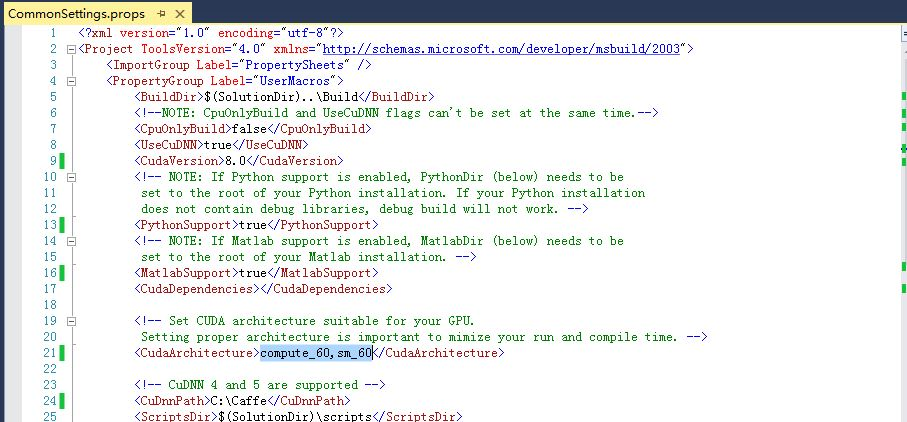
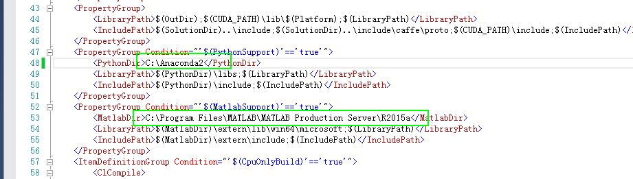

# Windows+VS2013 Caffe 编译安装教程

## 1. 安装cuda   
  `Cuda`是英伟达推出的`GPU加速`运算平台。我这里安装的是`cuda8.0`,已经安装过的忽略。windows下面安装还是非常简单的。   

## 2. 下载`cuDNN`(其实是个压缩包)   
  [下载链接](https://developer.nvidia.com/cudnn)   
  中间可能有个注册的过程,自己注册一下，下载V5版本。   

## 3. 从`Microsoft`官方`Github`上下载Caffe的源码压缩包.   
  百度网盘链接：   
  http://pan.baidu.com/s/1bpvZn4b 密码：snoh   
  (微软官方也移植了[Caffe-windows](https://github.com/Microsoft/caffe),在`windows`下面的配置会比较简单一点.)   

## 4. 安装   
1. 打开`caffe-master`文件夹,然后打开`windows`文件夹,看到里面一个`CommonSettings.props.example`文件,复制出来一份,并改名字为`CommonSettings.props`   
2. 用`VS2013`打开`Caffe.sln`(就到刚刚那个文件夹里面)   
3. 打开`CommenSetting.probs`.   
按照下图进行修改设置：   
   
   
4. 选择编译类型为`release,x64`:   
关闭视警告为错误(即设置为No)如果不设置的话在编译boost库的时候会由于文字编码的警告而报错.    
然后载开始编译,(先编译的是`libcaffe`).等啊等.....就编译成功了    
这个时候,在你刚刚解压出来的`caffe-master`文件夹下面就应该出现一个名叫`Build`的文件夹,    
以后编译的成功和运行需要的文件都会存放在`build\X64\Relase`下面.   
前面已经提示是先编译的`libcaffe`,在solution上面右击选择属性（properties）   
可以发现默认选择的是单任务，只编译`libcaffe`。这就是为什么之前默认先编译`libcaffe`。   
接下来，可以选择更多的任务来编译。类似地，我们接下来也可以只选择`caffe`来编译，同样的要注意`release和X64`.      
还有一些其他的需要的时候再编译：比如`pycaffe`。   

**注意**:
  之所以选择微软官方的版本,是因为在编译过程中会自动下载一些依赖库.    
