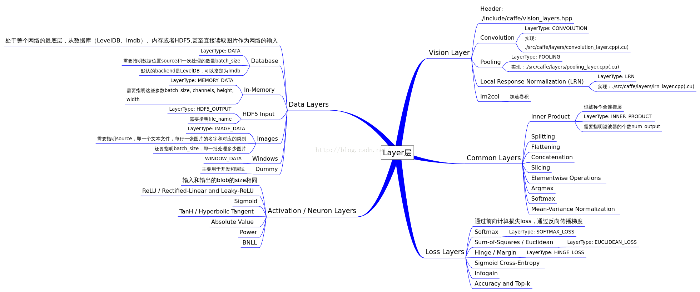

# 



## 3. proto 定义
```proto
message LayerParameter {
  optional string name = 1; // the layer name
  optional string type = 2; // the layer type
  repeated string bottom = 3; // the name of each bottom blob
  repeated string top = 4; // the name of each top blob

  // The train / test phase for computation.
  optional Phase phase = 10;

  // The amount of weight to assign each top blob in the objective.
  // Each layer assigns a default value, usually of either 0 or 1,
  // to each top blob.
  repeated float loss_weight = 5;

  // Specifies training parameters (multipliers on global learning constants,
  // and the name and other settings used for weight sharing).
  repeated ParamSpec param = 6;

  // The blobs containing the numeric parameters of the layer.
  repeated BlobProto blobs = 7;

  // Specifies whether to backpropagate to each bottom. If unspecified,
  // Caffe will automatically infer whether each input needs backpropagation
  // to compute parameter gradients. If set to true for some inputs,
  // backpropagation to those inputs is forced; if set false for some inputs,
  // backpropagation to those inputs is skipped.
  //
  // The size must be either 0 or equal to the number of bottoms.
  repeated bool propagate_down = 11;

  // Rules controlling whether and when a layer is included in the network,
  // based on the current NetState.  You may specify a non-zero number of rules
  // to include OR exclude, but not both.  If no include or exclude rules are
  // specified, the layer is always included.  If the current NetState meets
  // ANY (i.e., one or more) of the specified rules, the layer is
  // included/excluded.
  repeated NetStateRule include = 8;
  repeated NetStateRule exclude = 9;

  // Parameters for data pre-processing.
  optional TransformationParameter transform_param = 100;

  // Parameters shared by loss layers.
  optional LossParameter loss_param = 101;

  // Layer type-specific parameters.
  //
  // Note: certain layers may have more than one computational engine
  // for their implementation. These layers include an Engine type and
  // engine parameter for selecting the implementation.
  // The default for the engine is set by the ENGINE switch at compile-time.
  optional AccuracyParameter accuracy_param = 102;
  optional ArgMaxParameter argmax_param = 103;
  optional BatchNormParameter batch_norm_param = 139;
  optional BiasParameter bias_param = 141;
  optional ConcatParameter concat_param = 104;
  optional ContrastiveLossParameter contrastive_loss_param = 105;
  optional ConvolutionParameter convolution_param = 106;
  optional CropParameter crop_param = 144;
  optional DataParameter data_param = 107;
  optional DropoutParameter dropout_param = 108;
  optional DummyDataParameter dummy_data_param = 109;
  optional EltwiseParameter eltwise_param = 110;
  optional ELUParameter elu_param = 140;
  optional EmbedParameter embed_param = 137;
  optional ExpParameter exp_param = 111;
  optional FlattenParameter flatten_param = 135;
  optional HDF5DataParameter hdf5_data_param = 112;
  optional HDF5OutputParameter hdf5_output_param = 113;
  optional HingeLossParameter hinge_loss_param = 114;
  optional ImageDataParameter image_data_param = 115;
  optional InfogainLossParameter infogain_loss_param = 116;
  optional InnerProductParameter inner_product_param = 117;
  optional InputParameter input_param = 143;
  optional LogParameter log_param = 134;
  optional LRNParameter lrn_param = 118;
  optional MemoryDataParameter memory_data_param = 119;
  optional MVNParameter mvn_param = 120;
  optional ParameterParameter parameter_param = 145;
  optional PoolingParameter pooling_param = 121;
  optional PowerParameter power_param = 122;
  optional PReLUParameter prelu_param = 131;
  optional PythonParameter python_param = 130;
  optional RecurrentParameter recurrent_param = 146;
  optional ReductionParameter reduction_param = 136;
  optional ReLUParameter relu_param = 123;
  optional ReshapeParameter reshape_param = 133;
  optional ScaleParameter scale_param = 142;
  optional SigmoidParameter sigmoid_param = 124;
  optional SoftmaxParameter softmax_param = 125;
  optional SPPParameter spp_param = 132;
  optional SliceParameter slice_param = 126;
  optional TanHParameter tanh_param = 127;
  optional ThresholdParameter threshold_param = 128;
  optional TileParameter tile_param = 138;
  optional TripletLossParameter triplet_loss_param = 147;
  optional WindowDataParameter window_data_param = 129;
}
```