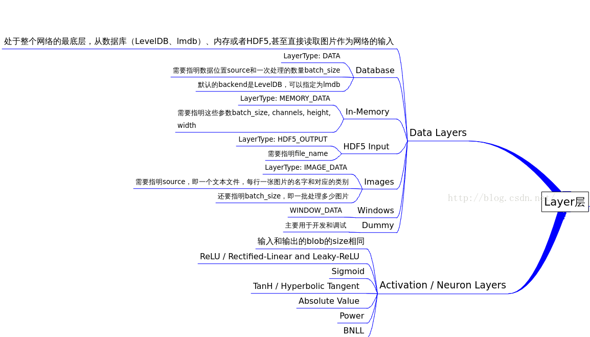
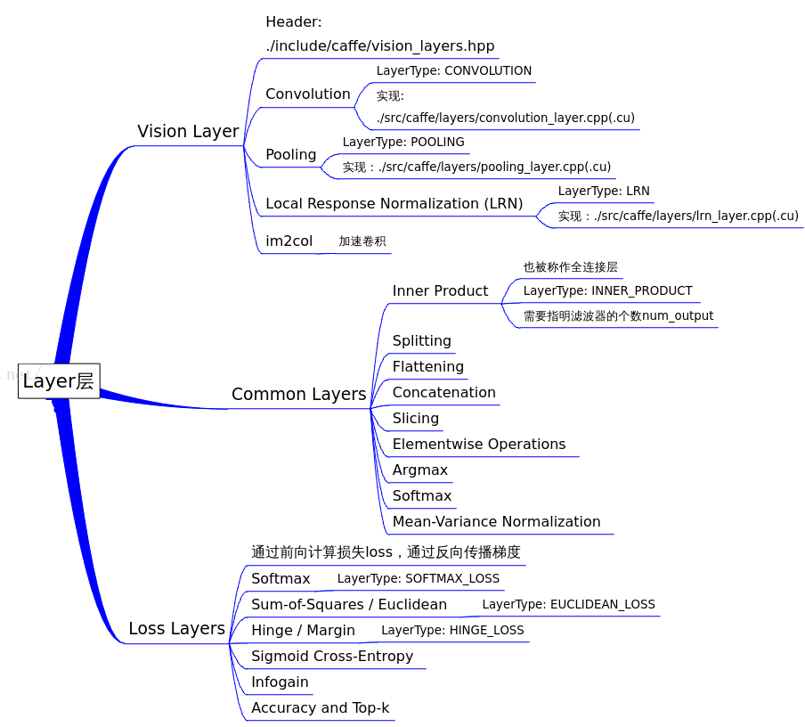

# 梳理`caffe`代码 - `layer`
 
## `caffe`中的`layers`
`Layer`(层)是`Caffe`中最庞大最繁杂的模块。由于`Caffe`强调模块化设计，因此只允许每个`layer`完成一类特定的计算，例如`convolution`操作、`pooling`、`非线性变换`、`内积运算`，以及`数据加载`、`归一化`和`损失计算`等。`layer`这个类可以说是里面最终的一个基本类了，深度网络呢就是一层一层的`layer`，相互之间通过`blob`传输数据连接起来。

我们先看一张图：





然后我们从头文件看看：
`Caffe`中与`Layer`相关的头文件有`7`个:
`layer.hpp`: 父类`Layer`，定义所有`layer`的基本接口。
`data_layers.hpp`: 继承自父类`Layer`，定义与`输入数据操作`相关的子Layer，例如`DataLayer`，`HDF5DataLayer`和`ImageDataLayer`等。
`vision_layers.hpp`: 继承自父类`Layer`，定义与`特征表达相关`的子Layer，例如`ConvolutionLayer`，`PoolingLayer`和`LRNLayer`等。
`neuron_layers.hpp`: 继承自父类`Layer`，定义与`非线性变换相关`的子Layer，例如`ReLULayer`，`TanHLayer`和`SigmoidLayer`等。
`loss_layers.hpp`: 继承自父类`Layer`，定义与`输出误差计算相关`的子Layer，例如`EuclideanLossLayer`，`SoftmaxWithLossLayer`和`HingeLossLayer`等。
`common_layers.hpp`: 继承自父类`Layer`，定义与`中间结果数据变形`、`逐元素操作相关`的子Layer，例如`ConcatLayer`，`InnerProductLayer`和`SoftmaxLayer`等。
`layer_factory.hpp`: `Layer工厂模式`类，负责维护现有可用layer和相应layer构造方法的`映射表`。

## `caffe`中的`layer.hpp`头文件

 和`layer`相关的头文件有：
```cpp
common_layers.hpp
data_layers.hpp
layer.hpp
loss_layers.hpp
neuron_layers.hpp
vision_layers.hpp
```
其中`layer.hpp`是抽象出来的基类，其他都是在其基础上的继承，也即剩下的五个头文件和上图中的五个部分。


在`device_alternate.hpp`中，通过`#ifdef CPU_ONLY`定义了一些宏来`取消GPU的调用`：
```cpp
#define STUB_GPU(classname)
#define STUB_GPU_FORWARD(classname, funcname)
#define STUB_GPU_BACKWARD(classname, funcname)
```

## `layer`中有这三个主要参数：
```
// 由protobuf格式定义，保存layer参数
LayerParameter layer_param_;          
// 以一组blobs表示的可学习参数   
vector<share_ptr<Blob<Dtype>>> blobs_;          
// 表示是否计算各个`blob`参数的`diff`，即传播误差    
vector<bool> param_propagate_down_;        
```

Layer类的构造函数
```cpp
explicit Layer(const LayerParameter& param) : layer_param_(param)
```
会尝试从`protobuf`文件读取参数。其三个主要接口：
```cpp
virtual void SetUp(const vector<Blob<Dtype>*>& bottom, vector<Blob<Dtype>*>* top)
inline Dtype Forward(const vector<Blob<Dtype>*>& bottom, vector<Blob<Dtype>*>* top);
inline void Backward(const vector<Blob<Dtype>*>& top, const vector<bool>& propagate_down, const <Blob<Dtype>*>* bottom);
```

SetUp函数需要根据实际的参数设置进行实现，对各种类型的参数初始化；

Forward和Backward对应前向计算和反向更新，输入统一都是bottom，输出为top，其中Backward里面有个propagate_down参数，用来表示该Layer是否反向传播参数。
在Forward和Backward的具体实现里，会根据Caffe::mode()进行对应的操作，即使用cpu或者gpu进行计算，两个都实现了对应的接口Forward_cpu、Forward_gpu和Backward_cpu、Backward_gpu，这些接口都是virtual，具体还是要根据layer的类型进行对应的计算（注意：有些layer并没有GPU计算的实现，所以封装时加入了CPU的计算作为后备）。另外，还实现了ToProto的接口，将Layer的参数写入到protocol buffer文件中。


data_layers.hpp
data_layers.hpp这个头文件包含了这几个头文件：
```cpp
#include "boost/scoped_ptr.hpp"
#include "hdf5.h"
#include "leveldb/db.h"
#include "lmdb.h"

#include "caffe/blob.hpp"
#include "caffe/common.hpp"
#include "caffe/filler.hpp"
#include "caffe/internal_thread.hpp"
#include "caffe/layer.hpp"
#include "caffe/proto/caffe.pb.h"
```
看到hdf5、leveldb、lmdb，确实是与具体数据相关了。data_layer作为原始数据的输入层，处于整个网络的最底层，它可以从数据库leveldb、lmdb中读取数据，也可以直接从内存中读取，还可以从hdf5，甚至是原始的图像读入数据。
关于这几个数据库，简介如下：
LevelDB是Google公司搞的一个高性能的key/value存储库，调用简单，数据是被Snappy压缩，据说效率很多，可以减少磁盘I/O，具体例子可以看看维基百科。
而LMDB（Lightning Memory-Mapped Database），是个和levelDB类似的key/value存储库，但效果似乎更好些，其首页上写道“ultra-fast，ultra-compact”，这个有待进一步学习啊～～
HDF（Hierarchical Data Format）是一种为存储和处理大容量科学数据而设计的文件格式及相应的库文件，当前最流行的版本是HDF5,其文件包含两种基本数据对象：
群组（group）：类似文件夹，可以包含多个数据集或下级群组；
数据集（dataset）：数据内容，可以是多维数组，也可以是更复杂的数据类型。
以上内容来自维基百科，关于使用可以参考[HDF5 小试——高大上的多对象文件格式](HDF5 小试——高大上的多对象文件格式)，后续会再详细的研究下怎么用。
caffe/filler.hpp的作用是在网络初始化时，根据layer的定义进行初始参数的填充，下面的代码很直观，根据FillerParameter指定的类型进行对应的参数填充。
// A function to get a specific filler from the specification given in
// FillerParameter. Ideally this would be replaced by a factory pattern,
// but we will leave it this way for now.
template <typename Dtype>
Filler<Dtype>* GetFiller(const FillerParameter& param) {
  const std::string& type = param.type();
  if (type == "constant") {
    return new ConstantFiller<Dtype>(param);
  } else if (type == "gaussian") {
    return new GaussianFiller<Dtype>(param);
  } else if (type == "positive_unitball") {
    return new PositiveUnitballFiller<Dtype>(param);
  } else if (type == "uniform") {
    return new UniformFiller<Dtype>(param);
  } else if (type == "xavier") {
    return new XavierFiller<Dtype>(param);
  } else {
    CHECK(false) << "Unknown filler name: " << param.type();
  }
  return (Filler<Dtype>*)(NULL);
}
internal_thread.hpp里面封装了pthread函数，继承的子类可以得到一个单独的线程，主要作用是在计算当前的一批数据时，在后台获取新一批的数据。
关于data_layer，基本要注意的我都在图片上标注了。
neuron_layers.hpp
输入了data后，就要计算了，比如常见的sigmoid、tanh等等，这些都计算操作被抽象成了neuron_layers.hpp里面的类NeuronLayer，这个层只负责具体的计算，因此明确定义了输入ExactNumBottomBlobs()和ExactNumTopBlobs()都是常量1,即输入一个blob，输出一个blob。
common_layers.hpp
NeruonLayer仅仅负责简单的一对一计算，而剩下的那些复杂的计算则通通放在了common_layers.hpp中。像ArgMaxLayer、ConcatLayer、FlattenLayer、SoftmaxLayer、SplitLayer和SliceLayer等各种对blob增减修改的操作。
loss_layers.hpp
前面的data layer和common layer都是中间计算层，虽然会涉及到反向传播，但传播的源头来自于loss_layer，即网络的最终端。这一层因为要计算误差，所以输入都是2个blob，输出1个blob。
vision_layers.hpp
vision_layer主要是图像卷积的操作，像convolusion、pooling、LRN都在里面，按官方文档的说法，是可以输出图像的，这个要看具体实现代码了。里面有个im2col的实现，看caffe作者的解释，主要是为了加速卷积的。
layer_factory.hpp
layer_factory比较重要我就放在下一篇里面了。
2. Detail
在这一Section中，我们深入到上一小节所讲的集中layer的细节中去。对于一些常用的layer，如卷积层，池化层（Pooling），还给出对应的proto代码。
2.1. 数据层（data_layers）

数据通过数据层进入Caffe，数据层在整个网络的底部。数据可以来自高效的数据库（LevelDB 或者 LMDB），直接来自内存。如果不追求高效性，可以以HDF5或者一般图像的格式从硬盘读取数据。
一些基本的操作，如：mean subtraction, scaling, random cropping, and mirroring均可以直接在数据层上进行指定。
1 Database

类型：Data
必须参数：
source: 包含数据的目录名称
batch_size: 一次处理的输入的数量
可选参数：
rand_skip: 在开始的时候从输入中跳过这个数值，这在异步随机梯度下降（SGD）的时候非常有用
backend [default LEVELDB]: 选择使用 LEVELDB 或者 LMDB
2 In-Memory

类型: MemoryData
必需参数：
batch_size, channels, height, width: 指定从内存读取数据的大小
MemoryData层直接从内存中读取数据，而不是拷贝过来。因此，要使用它的话，你必须调用MemoryDataLayer::Reset (from C++)或者Net.set_input_arrays (from Python)以此指定一块连续的数据（通常是一个四维张量）。
3 HDF5 Input

类型: HDF5Data
必要参数：
source: 需要读取的文件名
batch_size：一次处理的输入的数量
4 HDF5 Output

类型: HDF5Output
必要参数：
file_name: 输出的文件名
HDF5的作用和这节中的其他的层不一样，它是把输入的blobs写到硬盘
5 Images

类型: ImageData
必要参数：
source: text文件的名字，每一行给出一张图片的文件名和label
batch_size: 一个batch中图片的数量
可选参数：
rand_skip：在开始的时候从输入中跳过这个数值，这在异步随机梯度下降（SGD）的时候非常有用
shuffle [default false]
new_height, new_width: 把所有的图像resize到这个大小
6 Windows

类型：WindowData
7 Dummy

类型：DummyData
Dummy 层用于development 和debugging。具体参数DummyDataParameter。
2.2. 激励层（neuron_layers）

一般来说，激励层是element-wise的操作，输入和输出的大小相同，一般情况下就是一个非线性函数。
输入：
n×c×h×w
输出：
n×c×h×w
1 ReLU / Rectified-Linear and Leaky-ReLU

类型: ReLU
例子:
layer {
  name: "relu1"
  type: "ReLU"
  bottom: "conv1"
  top: "conv1"
}
可选参数：
negative_slope [default 0]： 指定输入值小于零时的输出。
ReLU是目前使用做多的激励函数，主要因为其收敛更快，并且能保持同样效果。标准的ReLU函数为max(x, 0)，而一般为当x > 0时输出x，但x <= 0时输出negative_slope。RELU层支持in-place计算，这意味着bottom的输出和输入相同以避免内存的消耗。
ReLU(x)=max{0,x}