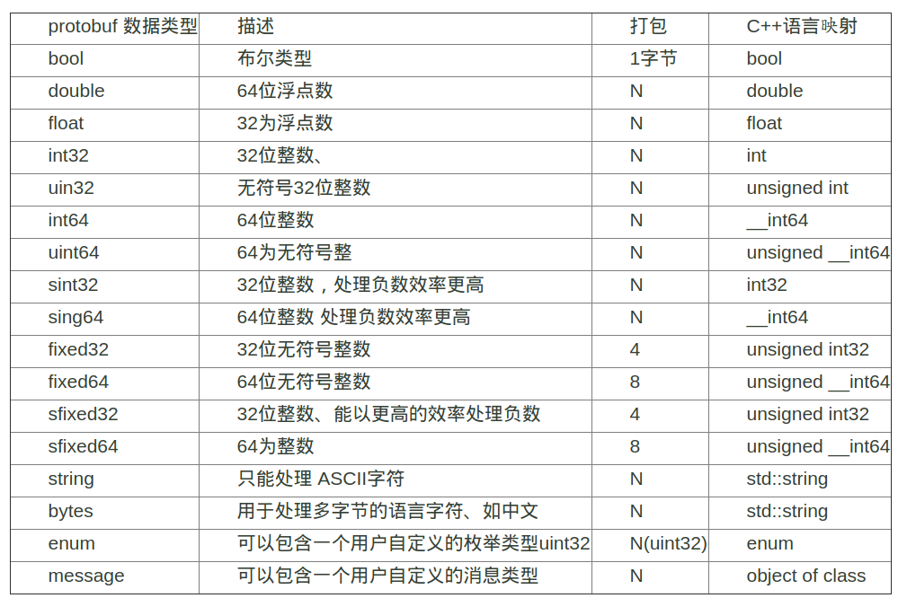

# protobuf 编译使用   

在网络传输中，经常有大端小端的区别，并且与我们编写的程序交互的，不一定也是`C/C++`，例如安卓，所以我们需要一个协议，能够进行数据的传输。大部分人最常用的，可能是`json`了，今天我们介绍另外一个工具，`protobuf`，这是一个`google`的开源项目。支持`c++,java,python`等多种语言。   

## 1. 下载与安装
```
# 第一种安装方式
[github代码地址](https://github.com/google/protobuf)
进入代码目录：
./configure --prefix=/usr/local/protobuf
sudo make
sudo make install

# 第二种安装方式  
sudo apt-get install protobuf-compiler
```
## 2. 使用  
使用`protobuf`需要我们定义一个`.proto`文件，用来定义`protobuf`消息。消息由至少一个字段组合而成，类似于`C`语言中的结构。`限定修饰符 | 数据类型 | 字段名称 | = | 字段编码值 | [字段默认值]`，每个字段都有一定的格式。   
2.1 限定修饰符    
required 表示这个字段必填   
optional 可选   
repeated 可以看作是在传递一个数组的值,并且可以为空  
2.2 数据类型   
   
2.3 字段名称   
`protobuf`建议以`下划线`命名而非`驼峰式`。例如`app_name`优于`appName`。   
2.4 字段编码值   
使用`protobuf`转化的`byte`中并没有带字段名称，而是一个字段编码，字段编码是一个`正32位`整数，通常来说，越小效率越高。   
2.5 默认值   
这个没啥好解释的。  
当然，`protobuf`还支持`Import/enum/package`等关键字。   
## 3. 示例  
3.1 新建一个`touch_message.proto`的文件，定义`TouchMesssage`理解为一个`心跳`的`data`。   
```proto
message TouchMessage{
	required string uid = 1;
	required string data_version = 2;
	required string time_stamp = 3;
	required string app_version = 4 [default = 'ver0.99'];
}
```
3.2 然后执行命令   
```
protoc touch_message.proto --cpp_out=./
```
我们就能看到生成的对应的`.h`跟`.cpp`文件了。打开`.cpp`文件，我们发现其实是生成一个类，类中有着对应的方法。`SerializeWithCachedSizes`是序列化，`MergePartialFromCodedStream`是反序列化。     
