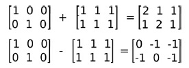

# 操作像素
 这里使用的都是一些基本的方法。

## 基本操作
1. 数据类型   
```cpp
CV_8UC1         // 8位无符号单通道  
CV_8UC3 		// 8位无符号3通道  
CV_8UC4  
CV_32FC1		// 32位浮点型单通道  
CV_32FC3		// 32位浮点型3通道  
CV_32FC4  
```
包括数据`位深度8位、32位`，数据类型`U:uchar、F:float`型以及通道数`C1：单通道、C3：三通道、C4：四通道`。        
2. 创建`Mat`的基本方法   
```cpp
# 不初始化矩阵数据，因此将出现随机值
cv::Mat a(cv::Size(5,5),CV_8UC1); 			// 单通道  
cv::Mat b = cv::Mat(cv::Size(5,5),CV_8UC3); // 3通道,每个矩阵元素包含3个变量    
cv::Mat c;
# 默认初始化方法
cv::Mat mz = cv::Mat::zeros(cv::Size(5,5),CV_8UC1); // 全零矩阵  
cv::Mat mo = cv::Mat::ones(cv::Size(5,5),CV_8UC1);  // 全1矩阵  
cv::Mat me = cv::Mat::eye(cv::Size(5,5),CV_32FC1);  // 对角线为1的对角矩阵  
```
3. 矩阵运算   
`OpenCV`的`Mat`类允许所有的矩阵运算。   
3.1 矩阵加减法   
```cpp 
cv::Mat a= Mat::eye(Size(3,2), CV_32F);  
cv::Mat b= Mat::ones(Size(3,2), CV_32F);  
cv::Mat c= a+b;  
cv::Mat d= a-b;
```
   
3.2 矩阵乘法   
使用"*"号计算矩阵与标量相乘(矩阵元素值缩放)，矩阵与矩阵相乘（必须满足矩阵相乘的行列数对应规则）。     
```cpp
Mat m1= Mat::eye(2,3, CV_32F);            // 使用cv命名空间可省略cv::前缀，下同  
Mat m2= Mat::ones(3,2, CV_32F);  

// Scalar by matrix  
cout << "\nm1.*2 = \n" << m1*2 << endl;   // scale

// matrix per element multiplication  
cout << "\n(m1+2).*(m1+3) = \n" << (m1+1).mul(m1+3) << endl;   // .mul()方法

// Matrix multiplication  
cout << "\nm1*m2 = \n" << m1*m2 << endl;  
```
    
3.3 矩阵转置       
矩阵转置是将矩阵的行与列顺序对调（第i行转变为第i列）形成一个新的矩阵。`OpenCV`通过`Mat`类的`t()函数`实现。    
```cpp
// 转置  
Mat m1= Mat::eye(2,3, CV_32F);    
Mat m1t = m1.t();  
```
3.4 求逆矩阵    
逆矩阵在某些算法中经常出现，在`OpenCV`中通过`Mat`类的`inv()`方法实现。   
```cpp
// 求逆  
Mat meInv = me.inv();  
```
3.5 计算矩阵非零元素个数     
计算物体的像素或面积常需要用到计算矩阵中的非零元素个数，`OpenCV`中使用`countNonZero()`函数实现。    
```cpp
// 统计非零元素个数  
int nonZerosNum = countNonZero(me); // me为输入矩阵或图像  
```
3.6 均值和标准差     
`OpenCV`提供了矩阵均值和标准差计算功能，可以使用`meanStdDev(src,mean,stddev)`函数实现。以下是参数说明：    
```
src – 输入矩阵或图像
mean – 均值，OutputArray
stddev – 标准差，OutputArray
```
```cpp
// 均值方差  
Mat mean;  
Mat stddev;  
meanStdDev(me, mean, stddev); 
``` 
需要说明的是，如果`src`是多通道图像或多维矩阵，则函数分别计算不同通道的均值与标准差，因此返回值`mean`和`stddev`为对应维度的向量。        
3.7 求最大最小值     
求输入矩阵的全局最大最小值及其位置，可使用函数：   
```cpp
void minMaxLoc(InputArray src, CV_OUT double* minVal,  
                           CV_OUT double* maxVal=0, CV_OUT Point* minLoc=0,  
                           CV_OUT Point* maxLoc=0, InputArray mask=noArray());  
参数：
src – 输入单通道矩阵（图像）.
minVal – 指向最小值的指针， 如果未指定则使用NULL
maxVal – 指向最大值的指针， 如果未指定则使用NULL
minLoc – 指向最小值位置（2维情况）的指针， 如果未指定则使用NULL
maxLoc – 指向最大值位置（2维情况）的指针， 如果未指定则使用NULL
mask – 可选的蒙版，用于选择待处理子区域
```


1. 读取图片到一个矩阵中；
```cpp
Mat imread(const string& filename, int flags=1)
...
cv::Mat image = cv::imread("boldt.jpg", 0);
```
imread()返回的是保存图片的像素矩阵`Mat`。其中第二个参数为0表示返回的是灰度图，>1返回的是3-通道图片。
2. 在一个图像框中显示图片，可以对这个图形框命名；
```cpp
cv::imshow("Image", image);
```
3. 将像素矩阵保存为图片，保存的图片名和格式可以指定；
```cpp
cv::imwrite("salted.bmp", image);
```
4. 等待用户输入;
```cpp
cv::waitKey(5000);
```
5. cv::Mat常用属性
```cpp
cv::Mat image；
image.cols;
image.rows;
image.channels();
image.at<uchar>(j, i); // 单通道像素点；
image.at<cv::Vec3b>(j, i)[0] // 三通道像素点；
```

## 高级操作
Mat.data表示的是矩阵的首地址；

1. 融合两张图片
```cpp
// Calculates the weighted sum of two arrays
void addWeighted(InputArray src1, double alpha, InputArray src2, double beta, double gamma, OutputArray dst, int dtype=-1)
// dst = src1*alpha + src2*beta + gamma;
```
2. 图像的分离和合并
`split()`将图像中的3个通道分离为单通道矩阵，并保存在一个`vector`中；这样就可以直接操作图像的某一个通道了，一般选用vector<Mat>().at(n)访问对应的通道数据。
将3个单通道矩阵合并为一张图片；
```cpp
void split(const Mat& m, vector<Mat>& mv );
void merge(const vector<Mat>& mv, OutputArray dst );
...
cv::split(image1, planes);
cv::merge(planes, result)；
```


3. 操作图像的某一个固定区域——ROI
```cpp
Rect_(_Tp _x, _Tp _y, _Tp _width, _Tp _height);
void copyTo( OutputArray m, InputArray mask );
...
cv::Mat imageROI = image(cv::Rect(385, 270, logo.cols, logo.rows));  // 获取图片中的某一区域
cv::addWeighted(imageROI, 1.0, logo, 0.3, 0., imageROI); // 对该区域进行处理
logo.copyTo(imageROI, mask);  // 将logo图像矩阵拷贝到imageROI；
...
imageROI = channels.at(1);  // 获取第二通道(G通道)对应的图像数据；
```
imageROI返回值是指向原图的ROI区域的指针，因此改变这个值相应的会体现在原图中。
Rect_()是模板类，参数为矩形框左上角的坐标和矩形框的长和宽。

4. 比较几种遍历图像方法的效率
获取当前系统的运行时间：
`cv::getTickCount()`可以获取系统当前`tick`的个数；
`cv::getTickFrequency()`可以获取一个`tick`的频率，即一秒包含几个`tick`；
因此计算程序运行时间(单位为ms)的代码为：
```cpp
double exec_time = (double)getTickCount();
// do something ...
exec_time = ((double)getTickCount() - exec_time)*1000./getTickFrequency();
```

5. 获取像素的前后左右行
 限制像素值在[0,255]之间，`cv::saturate_cast<uchar>()`;
 将图像看成是一个宽度x高度的矩阵，那么可以有以下3种方式来获取当前行：
 <1>Mat.ptr()，


## Mat方法
1. size()
返回图像的尺寸，长和宽。
2. create()
根据图像属性创建Mat
```cpp
void create(int rows, int cols, int type);   // 
void create(Size size, int type);
void create(int ndims, const int* sizes, int type);
```