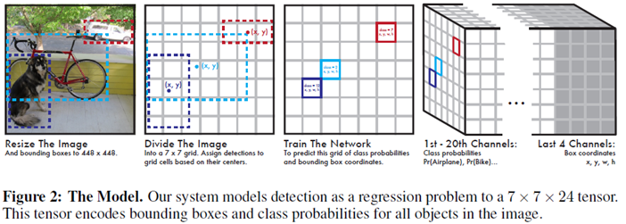
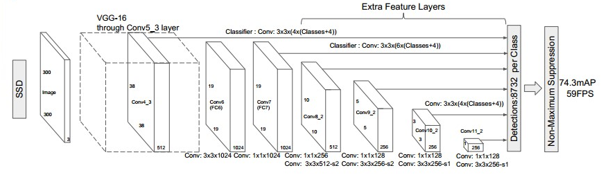
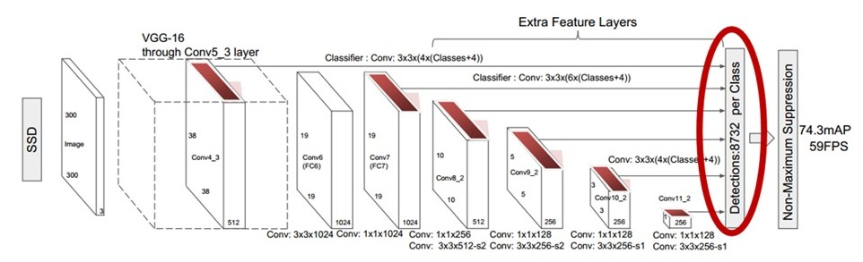

# ssd paper   

>ssd 官方版本中的图像类别为20，加上背景类为21类。   

## 1. 文章的方法介绍   
- `SSD`主要用来解决目标检测的问题（定位+分类），即输入一张待测图像，输出多个`box`的位置信息和类别信息；
- 测试时，输入一张图像到`SSD`中，网络输出一个下图最右边的`tensor`(多维矩阵)，对该矩阵进行非极大值抑制(`NMS`)就能得到每个目标的位置和`label`信息；
     
上图中，最右图的`1th-20th Channel`表示类别，每个`Channel`上的`map`对应原图，`last 4 channel`的每一个`map`分别对应`x,y,w,h`的偏移量。
因此，`前20`个通道确定类别信息(以概率表示)，`last 4 channel`个通道可以确定一个`box`的位置信息。   

## 2. 方法的`pipeline`和关键点    
- 检测用的多尺度`feature-maps`   
- 检测用的`convolutional-prediction`   
- 默认的`boxs`和`宽高比(aspect ratio)`    

## 3. 方法细节   
3.1 模型结构    
- SSD Network = Base Network + Auxilitary Structure;   
- Base Network(VGG16[stage1 ~ stage5]);   
- Auxilitary Structure(fc6,fc7->conv6,conv7;  添加4个卷积层conv8,conv9,conv10,conv11);   
   
3.2 多尺度特征`map`   
- 这些层的`size`逐渐的减小；  
- 每个特征层对应的预测检测用的卷积层模型都不同；  
    
对一个`size`为`m×n×p`的特征层，用于预测的基本元素的尺寸为`3×3×p`的`kernel`，计算类别的`score`或相应的默认框坐标的`shape offset`。`YOLO`使用的是全连接层实现的而不是这里的卷积层。   
3.3 default box
(a) 对于每一个训练的数据， `SSD` 只需要一个输入图片和`ground truth`真值框。    
(b) 在不同的`feature map`的不同位置选取不同长宽比的`default box`。对每一个`default box`预测`shape offset`和`confidences`；
(c) 模型的loss是localization loss(Smooth L1)和confidence loss(Softmax)的加权值。 

