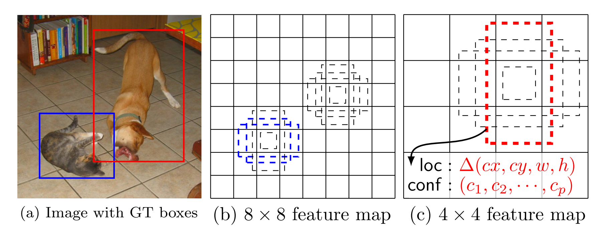
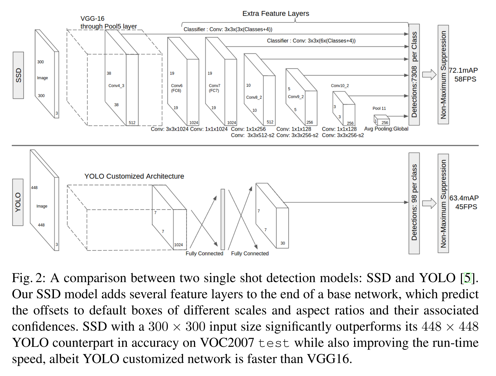

# ssd paper   

>ssd 官方版本中的图像类别为20，加上背景类为21类。   

## 1. 文章的方法介绍   
- `SSD`主要用来解决目标检测的问题（定位+分类），即输入一张待测图像，输出多个`box`的位置信息和类别信息；
- 测试时，输入一张图像到`SSD`中，网络输出一个下图最右边的`tensor`(多维矩阵)，对该矩阵进行非极大值抑制(`NMS`)就能得到每个目标的位置和`label`信息；
     
上图中，最右图的`1th-20th Channel`表示类别，每个`Channel`上的`map`对应原图，`last 4 channel`的每一个`map`分别对应`x,y,w,h`的偏移量。
因此，`前20`个通道确定类别信息(以概率表示)，`last 4 channel`个通道可以确定一个`box`的位置信息。   

## 2. 方法的`pipeline`和关键点    
- 检测用的多尺度`feature-maps`   
- 检测用的`convolutional-prediction`   
- 默认的`boxs`和`宽高比(aspect ratio)`    

## 3. 方法细节   
3.1 模型结构    
- SSD Network = Base Network + Auxilitary Structure;   
- Base Network(VGG16[stage1 ~ stage5]);   
- Auxilitary Structure(fc6,fc7->conv6,conv7;  添加4个卷积层conv8,conv9,conv10,conv11);   
   
3.2 多尺度特征`map`   
- 这些层的`size`逐渐的减小；  
- 每个特征层对应的预测检测用的卷积层模型都不同；  
    
对一个`size`为`m×n×p`的特征层，用于预测的基本元素的尺寸为`3×3×p`的`kernel`，计算类别的`score`或相应的默认框坐标的`shape offset`。`YOLO`使用的是全连接层实现的而不是这里的卷积层。   
3.3 default box
(a) 对于每一个训练的数据， `SSD` 只需要一个输入图片和`ground truth`真值框。    
(b) 在不同的`feature map`的不同位置选取不同长宽比的`default box`。对每一个`default box`预测`shape offset`和`confidences`；
(c) 模型的loss是localization loss(Smooth L1)和confidence loss(Softmax)的加权值。 

## 4. 整体流程    
4.1 Abstract   
这篇文章在既保证速度，又要保证精度的情况下，提出了 SSD 物体检测模型，与现在流行的检测模型一样，将检测过程整个成一个 `single deep neural network`。便于训练与优化，同时提高检测速度。  
SSD 将输出一系列离散化（discretization） 的 bounding boxes，这些 bounding boxes 是在 不同层次（layers） 上的 feature maps 上生成的，并且有着不同的 aspect ratio。   
**在 prediction 阶段**     
要计算出每一个 default box 中的物体，其属于每个类别的可能性，即 score，得分。如对于 PASCAL VOC 数据集，总共有 20 类，那么得出每一个 bounding box 中物体属于这 20 个类别的每一种的可能性。   
同时，要对这些 bounding boxes 的 shape 进行微调，以使得其符合物体的 外接矩形。还有就是，为了处理相同物体的不同尺寸的情况，SSD 结合了不同分辨率的 feature maps 的 predictions。  
相对于那些需要 object proposals 的检测模型，本文的 SSD 方法完全取消了 proposals generation、pixel resampling 或者 feature resampling 这些阶段。这样使得 SSD 更容易去优化训练，也更容易地将检测模型融合进系统之中。   
在 PASCAL VOC、MS COCO、ILSVRC 数据集上的实验显示，SSD 在保证精度的同时，其速度要比用 region proposals 的方法要快很多。   
SSD 相比较于其他单结构模型（YOLO），SSD 取得更高的精度，即是是在输入图像较小的情况下。如输入 300×300 大小的 PASCAL VOC 2007 test 图像，在 Titan X 上，SSD 以 58 帧的速率，同时取得了 72.1% 的 mAP。   
如果输入的图像是 500×500，SSD 则取得了 75.1% 的 mAP，比目前最 state-of-art 的 Faster R-CNN 要好很多。   
4.2 Introduction   
现金流行的 state-of-art 的检测系统大致都是如下步骤，先生成一些假设的 bounding boxes，然后在这些 bounding boxes 中提取特征，之后再经过一个分类器，来判断里面是不是物体，是什么物体。   
这类 pipeline 自从 IJCV 2013, Selective Search for Object Recognition 开始，到如今在 PASCAL VOC、MS COCO、ILSVRC 数据集上取得领先的基于 Faster R-CNN 的 ResNet 。但这类方法对于嵌入式系统，所需要的计算时间太久了，不足以实时的进行检测。当然也有很多工作是朝着实时检测迈进，但目前为止，都是牺牲检测精度来换取时间。   
本文提出的实时检测方法，消除了中间的 bounding boxes、pixel or feature resampling 的过程。虽然本文不是第一篇这样做的文章（YOLO），但是本文做了一些提升性的工作，既保证了速度，也保证了检测精度。  
这里面有一句非常关键的话，基本概括了本文的核心思想：   
Our improvements include using a small convolutional filter to predict object categories and offsets in bounding box locations, using separate predictors (filters) for different aspect ratio detections, and applying these filters to multiple feature maps from the later stages of a network in order to perform detection at multiple scales.   
本文的主要贡献总结如下：   
提出了新的物体检测方法：SSD，比原先最快的 YOLO: You Only Look Once 方法，还要快，还要精确。保证速度的同时，其结果的 mAP 可与使用 region proposals 技术的方法（如 Faster R-CNN）相媲美。  
SSD 方法的核心就是 predict object（物体），以及其 归属类别的 score（得分）；同时，在 feature map 上使用小的卷积核，去 predict 一系列 bounding boxes 的 box offsets。  
本文中为了得到高精度的检测结果，在不同层次的 feature maps 上去 predict object、box offsets，同时，还得到不同 aspect ratio 的 predictions。  
本文的这些改进设计，能够在当输入分辨率较低的图像时，保证检测的精度。同时，这个整体 end-to-end 的设计，训练也变得简单。在检测速度、检测精度之间取得较好的 trade-off。  
本文提出的模型（model）在不同的数据集上，如 PASCAL VOC、MS COCO、ILSVRC， 都进行了测试。在检测时间（timing）、检测精度（accuracy）上，均与目前物体检测领域state-of-art 的检测方法进行了比较。  
4.3 The Single Shot Detector（SSD）   
这部分详细讲解了 SSD 物体检测框架，以及 SSD 的训练方法。   
这里，先弄清楚下文所说的 default box 以及 feature map cell 是什么。看下图Fig.1：   
   
feature map cell 就是将 feature map 切分成 8×8 或者 4×4 之后的一个个 格子；   
而 default box 就是每一个格子上，一系列固定大小的 box，即图中虚线所形成的一系列 boxes。   
4.4 Model  
SSD 是基于一个前向传播 CNN 网络，产生一系列 固定大小（fixed-size） 的 bounding boxes，以及每一个 box 中包含物体实例的可能性，即 score。之后，进行一个 非极大值抑制（Non-maximum suppression） 得到最终的 predictions。  
SSD 模型的最开始部分，本文称作 base network，是用于图像分类的标准架构。在 base network 之后，本文添加了额外辅助的网络结构：  
**Multi-scale feature maps for detection**     
在基础网络结构后，添加了额外的卷积层，这些卷积层的大小是逐层递减的，可以在多尺度下进行 predictions。  
**Convolutional predictors for detection**   
每一个添加的特征层（或者在基础网络结构中的特征层），可以使用一系列 convolutional filters，去产生一系列固定大小的 predictions，具体见 Fig.2。   
对于一个大小为 m×n，具有 p 通道的特征层，使用的 convolutional filters 就是 3×3×p 的 kernels。产生的 predictions，那么就是归属类别的一个得分，要么就是相对于 default box coordinate 的 shape offsets。    
在每一个 m×n 的特征图位置上，使用上面的 3×3 的 kernel，会产生一个输出值。bounding box offset 值是输出的 default box 与此时 feature map location 之间的相对距离（YOLO 架构则是用一个全连接层来代替这里的卷积层）。   
**Default boxes and aspect ratios** 
每一个 box 相对于与其对应的 feature map cell 的位置是固定的。 在每一个 feature map cell 中，我们要 predict 得到的 box 与 default box 之间的 offsets，以及每一个 box 中包含物体的 score（每一个类别概率都要计算出）。   
因此，对于一个位置上的 k 个boxes 中的每一个 box，我们需要计算出 c 个类，每一个类的 score，还有这个 box 相对于 它的默认 box 的 4 个偏移值（offsets）。于是，在 feature map 中的每一个 feature map cell 上，就需要有 (c+4)×k 个 filters。对于一张 m×n 大小的 feature map，即会产生 (c+4)×k×m×n 个输出结果。  
这里的 default box 很类似于 Faster R-CNN 中的 Anchor boxes，关于这里的 Anchor boxes，详细的参见原论文。但是又不同于 Faster R-CNN 中的，本文中的 Anchor boxes 用在了不同分辨率的 feature maps 上。  
     

