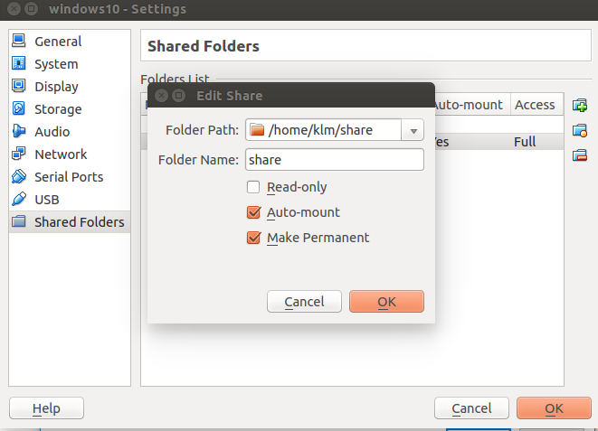
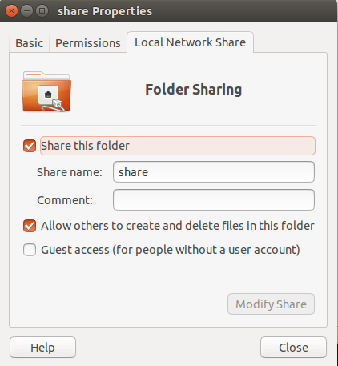
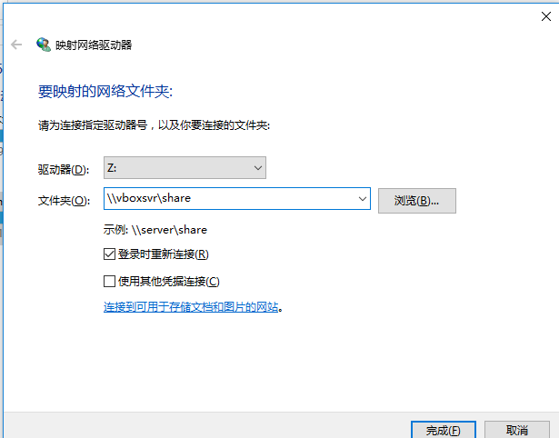
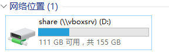

# Ubuntu中安装windows10
ubuntu下使用virtualbox虚拟机安装试用win10系统...     
 
1. 输入如下的命令安装virtualbox虚拟机。    
```bash
$ sudo apt-get install virtualbox
```
2. 创建安装`win10`的磁盘空间   
2.1 在dash菜单搜索virtualbox并打开。   
2.2 选择 “新建”，名称输入“windows10”，类型选择“microsoft windows”,版本选择“windows 10(具体32位还是64位根据你下载的win10系统定)”，然后“下一步”。   
2.3 虚拟硬盘，选择“现在创建虚拟硬盘”，然后“创建”。虚拟硬盘文件类型就选择默认的“VDI (VirtualBox硬盘映像)”，“下一步”。   
2.4 存储在物理硬盘上，选择默认的“动态分配(D)”，“下一步”。   
2.5 文件位置和大小，位置不需要动，默认是“用户/VirtualBox VMs文件夹”，硬盘大小默认是32G，这里我也是默认的，“创建”，然后就会多出个“windows10”。    
3. 给虚拟机安装windows10操作系统    
3.1 选中“windows10”，点击 “设置”。   
3.2 选择 “存储”，选择右边的 “没有盘片（empty）”，点击右边的小光盘图标，“选择一个光盘文件”，然后找到自己的windows10的iso文件位置选中它。   
3.3 完成设置后，选择“windows10”，点击“启动”，开始运行虚拟机。   
3.4 默认就是“中文(简体，中文)”，如果不是重新选择，“下一步”。点击“现在安装”。   
3.5 因为是虚拟机，还没有安装过系统，所以我选择 “自定义：仅安装 Windows (高级)”   
3.6 直接选择默认的驱动器，“下一步”。下面就慢慢的等待它漫长的安装过程吧。   
4. 安装增强插件让windows更好用
4.1 选择 “设备”--“安装增强功能” ，第一次使用，这里会提示需要下载增强插件，下载下来就好用了。     
4.2 加载增强插件后，会提示安装，或者在 “此电脑” 中找到 “CD驱动器VirtualBox Guest Addition”， 进入执行其中的  “VboxWindowsAdditions” ，一步一步安装，过程中可能提示不兼容也选择安装。    
4.3 安装完成后，重启自己的windows10就好用多了，桌面可以自适应了。    
5. windows和Ubuntu文件共享     
5.1 设置virtualbox中主机的共享文件夹   
    
5.2 设置share文件夹的属性    
   
5.3 在windows中映射网络驱动器。      
   
到此，共享文件夹就设置好了。    



